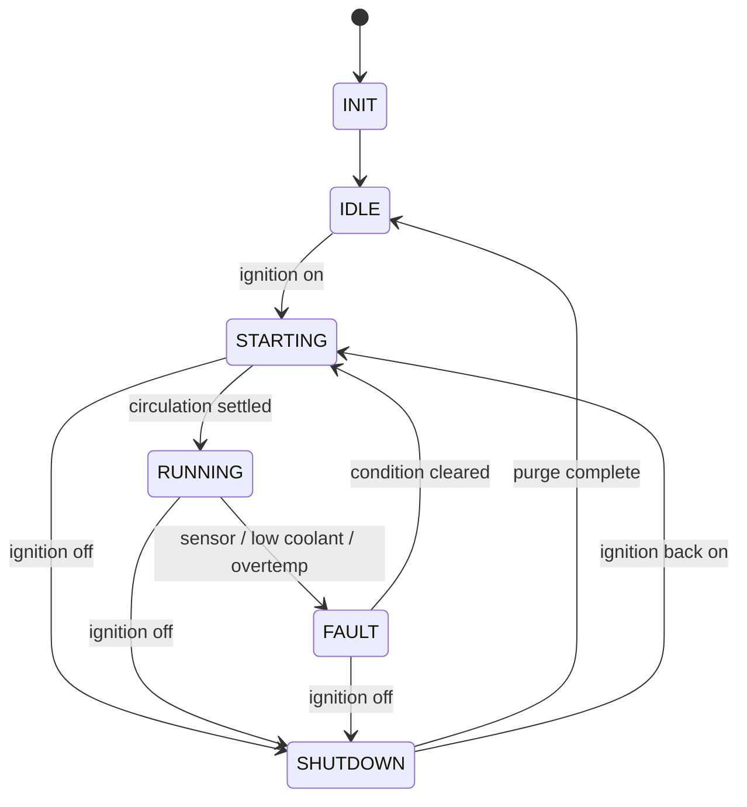

# EAE_Firmware

Cooling loop controller for the EAE vehicle, written as a simulation. It
models the coolant loop that keeps the inverter and DC-DC converter below the
temperature at which they would derate.

This is the firmware counterpart to the PLC control logic in the coding
section. The control intent is the same; the structure is different, because
a firmware target allows things a ladder-style scan does not — closed-loop
control, explicit operating modes, and a CAN link to the instrument display.

## Building and running

The project builds on Linux. A dev container is included, so on macOS or
Windows you can open the folder in VS Code and choose **Reopen in Container**
to get an Ubuntu toolchain without installing one locally.

```sh
./run.sh
```

That configures, builds, and runs with default parameters. Arguments are
forwarded to the program:

```sh
./run.sh --setpoint 50 --kp 8 --ki 0.4 --kd 2 --duration 180
```

To run the tests:

```sh
cd build && ctest --output-on-failure
```

### Dependencies

GoogleTest and CLI11 are fetched by CMake at configure time and are not
committed to this repository. There is nothing to install first beyond a
compiler and CMake.

## What it simulates

A scripted run exercises the controller end to end: warm-up under light load,
a step increase in load, a setpoint change arriving over CAN, a low coolant
fault and its recovery, and key-off with the shutdown purge. Each row of the
output is one reporting interval.

```
    time | state     | coolant | setpoint |   fan | pump | fault
---------|-----------|---------|----------|-------|------|----------------
    50.0 | RUNNING   |   44.3C |    45.0C |    0% |   ON | NONE
    65.0 | RUNNING   |   49.4C |    45.0C |   46% |   ON | NONE
   125.1 | FAULT     |   50.4C |    50.0C |  100% |   ON | LOW_COOLANT
   165.1 | SHUTDOWN  |   54.8C |    50.0C |    0% |   ON | NONE
```

## Structure

| Component | File | Role |
|---|---|---|
| PID controller | `src/pid.cpp` | Closed-loop fan control |
| State machine | `src/state_machine.cpp` | Operating modes and fault handling |
| CAN bus | `src/can_bus.cpp` | Simulated bus with bounded queues |
| CAN messages | `src/can_messages.cpp` | Frame encoding and validation |
| Thermal plant | `src/thermal_plant.cpp` | Physical model of the coolant loop |
| Application | `src/main.cpp` | Scenario, control cycle, reporting |

Control logic lives in a library that both the application and the tests link
against, so what is tested is exactly what runs.

### Control loop

The state machine decides *whether* the loop is under control; the PID decides
*how hard* the fan works when it is. Six states:



`STARTING` runs the pump for a short prime before the PID is permitted to act.
Coolant that has been sitting still is not representative of the loop, so a
reading taken from a stagnant pocket at the sensor is not a sound basis for
control.

`SHUTDOWN` keeps the pump running after key-off. Heat already in the silicon
has to go somewhere; stopping circulation immediately lets it soak into
surrounding components instead of leaving through the radiator.

Fault recovery returns through `STARTING` rather than straight to `RUNNING`,
so the pump re-primes and the PID re-enters from a cleared state. The
overtemperature latch clears in `IDLE`, which means a key cycle always gives a
clean start while a condition that is still physically present re-trips
immediately.

### PID

The controller is **reverse-acting**: more fan produces a lower temperature,
the opposite of the heating convention a textbook PID assumes. Without this
the fan runs hardest exactly when the coolant is coldest.

It also implements integral anti-windup. With the fan saturated at 100% and
the coolant still too hot, an unguarded integral keeps accumulating error it
cannot act on; when the temperature finally falls, that stored value holds the
fan at full long past the point it should have backed off. The integral is
only committed when the output is within limits or when the error has reversed
and is unwinding it.

### CAN

The PV450 display specifies two CAN 2.0B ports. This bus has two nodes, the
PLC and the display, so there is no need to conform to a higher-level standard
such as J1939; an application-specific 11-bit message set is sufficient.

| ID | Direction | Contents |
|---|---|---|
| `0x100` | PLC to display | Coolant temperature (int16, 0.1 C/bit), sensor valid flag |
| `0x101` | PLC to display | Pump enable, fan PWM percent |
| `0x102` | PLC to display | Controller state, active fault code |
| `0x200` | Display to PLC | Requested setpoint (int16, 0.1 C/bit) |

Signals are packed little-endian. The fault code is transmitted rather than a
single fault bit, so the display can show which condition tripped instead of a
generic warning lamp.

Every decoder validates before it returns anything: wrong identifier, short
frame, and unrecognised enum values are all rejected. The inbound setpoint is
additionally range-checked, because a frame from another node is untrusted
input and a corrupted value must not be allowed to drive the loop.

Transmit and receive queues are bounded and count discarded frames. Real
controllers have finite buffers and shed frames under sustained load; modelling
that means the behaviour appears in a test rather than for the first time on
hardware.

### Thermal model

A first-order model: heat in from the inverter and DC-DC, heat out
proportional to the temperature difference above ambient, scaled by fan speed
and by whether the pump is circulating. Temperature integrates the difference.

It exists so the PID has something to act against. The parameters are
plausible for a loop of this size and are chosen to make the simulation move
at a watchable rate; they are not measured from any vehicle.

## Testing

53 unit tests covering the PID (including saturation, anti-windup, and
direction of action), every state transition and fault path, CAN framing and
decoder rejection cases, and the thermal model including its steady state.

## Assumptions

Thresholds, gains, and plant parameters are demonstration values. The 65 °C
trip and 60 °C clear points, the prime and purge intervals, and the PID gains
would all need to come from the inverter and DC-DC thermal limits, component
datasheets, and loop testing before use.

The fail-safe response is an assumption too. Commanding maximum cooling on a
fault is one reasonable choice; a production system might derate or shut down
instead, and that decision belongs with the vehicle safety requirements rather
than with the control code.

## AI acknowledgement

I attempted this section to complete a full submission rather than because I had prior firmware experience.

The C++ implementation in this repository was written with AI assistance. I specified what the system needed to do, drawing on the cooling loop analysis and electrical design from the earlier sections, and I reviewed, tested, and can explain the resulting code and the design decisions behind it — including why the PID is reverse-acting, what integral anti-windup prevents, and why the state machine has distinct startup and shutdown states. I would not claim to have written the C++ unaided.

My own engineering contribution is strongest in the system and electrical design: the cooling loop architecture, component selection and integration, and the PLC control logic in the coding section. This repository applies that same control intent in a firmware context.
